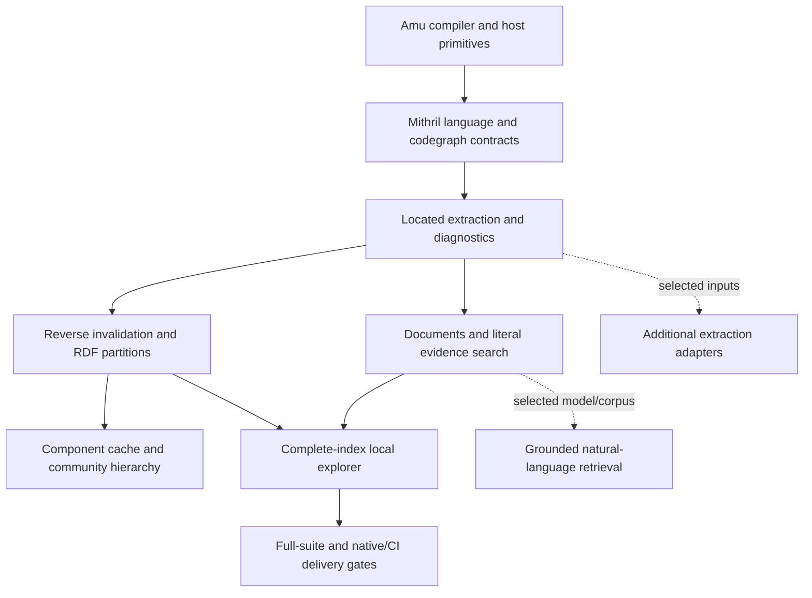

# Codegraph work map — Amu host boundary

Updated against the local working tree on 2026-10-08.

Mithril's compiler uses Amu. Compiler self-hosting and a bootstrap fixed point
are explicitly outside this plan. `language.mith` and `codegraph.mith` remain
executable configuration/admission contracts; host primitives remain CLJK/CLJS.
The former S1–S3 migration track is removed following the product decision.

| ID | State | Delivered locally | Remaining gate |
| --- | --- | --- | --- |
| R0 | Partial | Pinned-dependency SCI runner; scoped regression; HTTP integration harness; explicit change manifest | Full suite encountered ENOSPC and CLI subprocess failures; rerun in a stable environment. Native Amu validation and CI/release are separate gates. |
| R1 | Implemented for admitted forms | Sequential comprehension bindings/qualifiers, letfn, conditional binding scopes, as->, destructuring defaults, dynamic binding references, qualified core scope forms, renamed refers; unresolved classifications | Macro expansion, runtime dispatch and unsupported lexical forms remain outside static guarantees. Builtin classification is a finite catalogue candidate, not runtime proof. |
| R2 | Implemented | Cached extraction, reverse dependency invalidation, per-file canonical RDF partitions, connected-component community cache, affected/reused counts | Manifest reading, global name tables, file projection and digest assembly still inspect global state. Additional performance benchmarks are needed before large-repository throughput claims. |
| R3 | Implemented | Markdown ATX/Setext headings; explicit inline/reference/collapsed/shortcut links outside fences; exact literal source search with spans, source digests and pagination | Semantic JSON-LD entity locations explicitly retain whole-document precision. Arbitrary Markdown extensions and semantic prose links are not extracted. |
| R4 | Implemented | Loopback full-index web explorer, paginated catalog/search/neighbors/content, snapshot revision checks, source and impact, communities, explicit refresh; offline export retained | Watcher/debounce and richer path UI are optional extensions. Graph drawing is a bounded view; API/search use the complete admitted index. |
| R5 | Implemented baseline | Deterministic connected-component → community hierarchy; weighted local modularity optimization within each component; content-addressed cache and structural stability fixtures | More real-corpus quality measurements and comparison with other community algorithms; this implementation is not Louvain/Leiden. |
| R6 | Expansion | Shared located ontology and inert adapter contract exist | Choose TS/JS/Python/PDF or other target inputs, then implement dedicated parsers. No additional language support is implied by the current parser. |
| G1 | Optional expansion | Literal graph/document evidence retrieval, saved Mithril originals/claims and OWL replay with separate inference layers | Natural-language ranking/answering, model adapters and grounding evaluation need a separately selected corpus/model scope. |

The implemented baseline is local. No deployment, public availability, native
Amu run or PR merge is established by SCI tests or a loopback browser check.
See `codegraph-and-language-bootstrap.md` for contracts and historical evidence,
`codegraph-validation-20261008.md` for current checks, and
`codegraph-change-manifest.md` for the intended change boundary.
