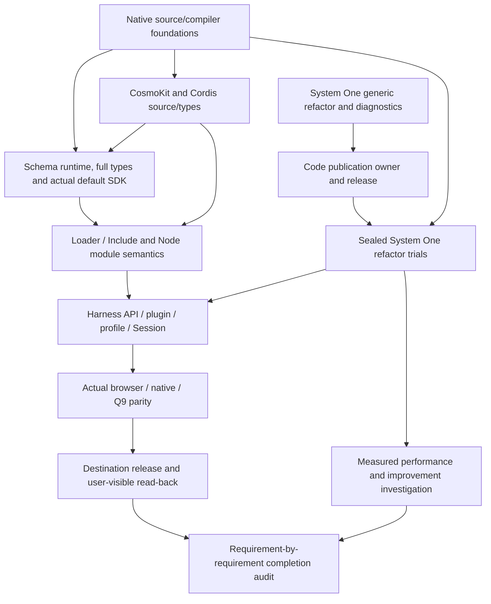

# Mithril Harness and System One continuation map

Updated: 2026-10-09 (JST). This is a continuation record, not a completion claim.
Verify the current checkout, remote main, CI and public status before relying on
recorded state. Repository documentation uses English; conversation and original
evidence retain their selected language.

## Complete objective

Refactor the original mithril-lang organization DeepSeek Harness into a genuine
Mithril-language Harness with the same API, plugin, profile and Session behavior.
Verify actual browser/native/Q9 behavior and delivery to the intended repository.
Use code.mithril.fund's System One Coding for actual refactor work, then measure
and investigate improvements using fixed inputs, baseline/candidate checks and
real receipts. Renaming, observation helpers or finite passing groups cannot
substitute for this objective.

## Locations and saved state

| Item | Location / identity | State |
| --- | --- | --- |
| Compiler checkout | `/Users/junkawasaki/github/mithril-lang/mithril-harness-language` | `codex/native-module-operations` |
| Saved work checkpoint | `82bd71fbfbf27e4ed3e08ba03898eb9a01a31ed4` | WIP committed and pushed before the requested pause |
| Schema SDK | https://github.com/mithril-lang/mithril/pull/79 | Merged at `34ca28d6524c27a6c11e24c01bddeca9da35763d`; head `b211a8d076bdb85f77859a2563ba3f79ee5e433f` qualified |
| Schema branch CI | `37894254763`, job `113701855514` | Terminal success; full source/package/all 14 declaration stages audited |
| Schema main CI | `37895861420` | Terminal success; all 14 stages audited, exact branch/main tree verified |
| System One checkout | `/Users/junkawasaki/github/mithril-lang/mithril-system-one-refactor` | PR #893 merged; qualified exact source `cc8d1bfb6dcbe30c302d24cbec214c07141e42e7` |
| Operator evidence | `/Users/junkawasaki/github/mithril-lang/mithril-harness-evaluation-2026-10-07` | Logs, receipts and readonly reference |
| Original Harness | Evidence directory's `reference-harness-441416` | Snapshot `441416c0048aa4281bffe59c1c7b5e13e08a9ec1` |

The intended destination Harness repository still requires confirmation. The
accessible catalog does not prove organization-wide absence. Do not create a
substitute repository without resolving the destination.

## Dependency map

Arrows mean prerequisite to dependent work. Resolve prerequisites before using
results to qualify their dependents.



Code publication and native-language work have independent paths. The missing
Code owner is not a reason to stop meaningful compiler/dependency work.

## Qualified evidence and remaining gates

| Area | Evidence | Remaining gate |
| --- | --- | --- |
| Native finite numeric literals | PR #77/main `4106e9e…`, main CI `37889375930` audited success | Reader normalizes integer `-0`; use `-0.0` or `-0e0` for negative zero |
| Ambient callback references | PR #78/main `92a27a8e…`, main CI `37891594652` audited success | Finite checks are not universal callback equivalence |
| Schema SDK | PR #79; local 14 stages and branch CI succeeded; both actual CLI targets; 54 positive/21 negative type groups, 26 runtime groups, serialized Date and full own static/prototype descriptors | Actual browser behavior and broader inputs |
| Native module operations | First resumed standalone CLI and original-paired contract passed after fixture corrections | PR and main delivery; local 74/306 native, 40-export/7-frozen package and all 14 declaration stages passed |
| System One generic refactor | PR #893 merged; selected-source replacement/local edits, baseline/candidate Docker checks, fixed refusal detail, durable receipts, signed Code CI/CD | New diagnostics publication and actual model evaluation |
| Code qualification | Exact `cc8d1bfb…`: Code93/quota34/Python8/CI-release12/hold24/real Docker2/Todo17 plus browser fixtures; verified signature/source/676 assets | Main has advanced; rerun on exact current main before release |
| Public Code | Most recent read: `fca16aec22fc0207ec7d91e863d3384aa92e161e`, ready=true, repository_refactor_proposals=true, durable_refactor_receipts=true | New diagnostics unpublished; arbitrary_repository_execution=false |

Node execution of a `js-browser` artifact and actual browser testing are separate
evidence. Complete type declarations and universal runtime equivalence are also
separate. Candidate runtime cannot delegate to original Schema or dependency code.

## Current source change

The saved WIP adds `host-import-meta` and `host-dynamic-import` form tags, bounded
AST admission and direct native emission, with standalone/ESM/package fixtures.
The first pre-pause probe refused an unregistered `mithril/param` fixture tag.
It was corrected to `rdf/node`; resumed compilation succeeds. The comparison
fixture now uses actual filesystem paths on macOS. A second fixture correction
uses direct exports for package-library output, retaining explicit factory mode
as a separate tested case.

New admission and actual CLI tests cover both target labels and all four output
forms. Local validation passed: 74 native tests / 306 assertions, the 40-export /
seven-frozen-artifact package contract and all 14 declaration stages. PR and
main delivery remain separate gates. See `test/qualification/native-module-operations/README.md`.

Original dependency sites:

- `vendor/loader/src/internal.ts:109`: `createRequire(import.meta.url)`.
- `vendor/loader/src/config/tree.ts:124,126`: URL/specifier dynamic import.
- `vendor/include/src/index.ts:222`: filename dynamic import.

Retain Node internal-loader v1/v2 classification, no-internals fallback, actual
host capabilities, YAML dialect and config persistence contracts. A fixed URL or
replacement resolver does not establish identical module semantics.

## Next work

1. Schema main CI `37895861420` is now audited successfully. Continue from the
   native module operations qualification; retain exact-main/tree evidence.
2. Finish native module operations: malformed/scope/depth/guest tests, exact old
   artifact preservation, both targets/output forms and independent host oracle.
   Complete source/package/declaration regressions and normal PR/main delivery.
3. Port Loader/Include by complete source closure, SCC and public type graph.
   Then port Harness API/plugin/profile/Session and verify actual browser/native/Q9.
4. Resolve the Code owner, qualify current main, publish through the dedicated
   guarded CI owner and read back source/status/assets.
5. Run separately sealed real System One tasks against the current compiler and
   independent baseline/candidate checks. Record actual attempts, repairs,
   completion/usage/latency, acceptance and adoption. Investigate measured failures.
6. Verify the destination release and audit every original requirement before
   marking the full objective complete.

Pinned local commands (compiler checkout):

```sh
node scripts/test-native-js.mjs --engine ../mithril-harness-evaluation-2026-10-07/compiler-image/engine/cli.js
node scripts/test-native-package.mjs --engine ../mithril-harness-evaluation-2026-10-07/compiler-image/engine/cli.js
node scripts/test-native-declarations.mjs --engine ../mithril-harness-evaluation-2026-10-07/compiler-image/engine/cli.js --typescript ../mithril-harness-evaluation-2026-10-07/native-js-declarations-system-one/image/typed-deps/node_modules/typescript/lib/typescript.js --type-roots ../mithril-harness-evaluation-2026-10-07/native-js-declarations-system-one/image/typed-deps/node_modules/@types
```

Evidence files include `schema-sdk-full-declarations.log`,
`schema-sdk-branch-ci.log`, `native-ambient-main-ci.log`,
`schema-sdk-qualification.json` and `native-ambient-blocker-frontier.json`.

## System One owner and evaluation inputs

The dedicated Code deployment host/checkout and existing narrow CI credential
reference remain unknown. Do not put credential values in chat/tasks/receipts/Git.
Docker on gad does not establish deployment ownership. The last observed
`MITHRIL_CODE_PUBLISHER` repository variable was absent (404). Retain real owner
coordination, drained competing main jobs, clean exact live main, Code-specific
signed receipt, actual compatible rollback, unchanged quota namespace, all
migration holds and full public asset read-back. Follow Fund's own AGENTS.md and
standalone publisher contract; another product's receipt cannot publish Code.

Historical real trial: `chatcmpl-ea230788-d0e3-40a9-93cb-00ee136cbea6`,
140.266 seconds, 26706 prompt / 5261 completion tokens, one attempt, zero repairs,
`invalid_refactor_edits`, missing detail, no admitted candidate or performance
gain. Do not infer its missing cause or retry an unknown historical outcome.
New trials require a separate sealed contract and real receipts; include repairs
in measurement and distinguish source/CI/publication/live/installed evidence.
