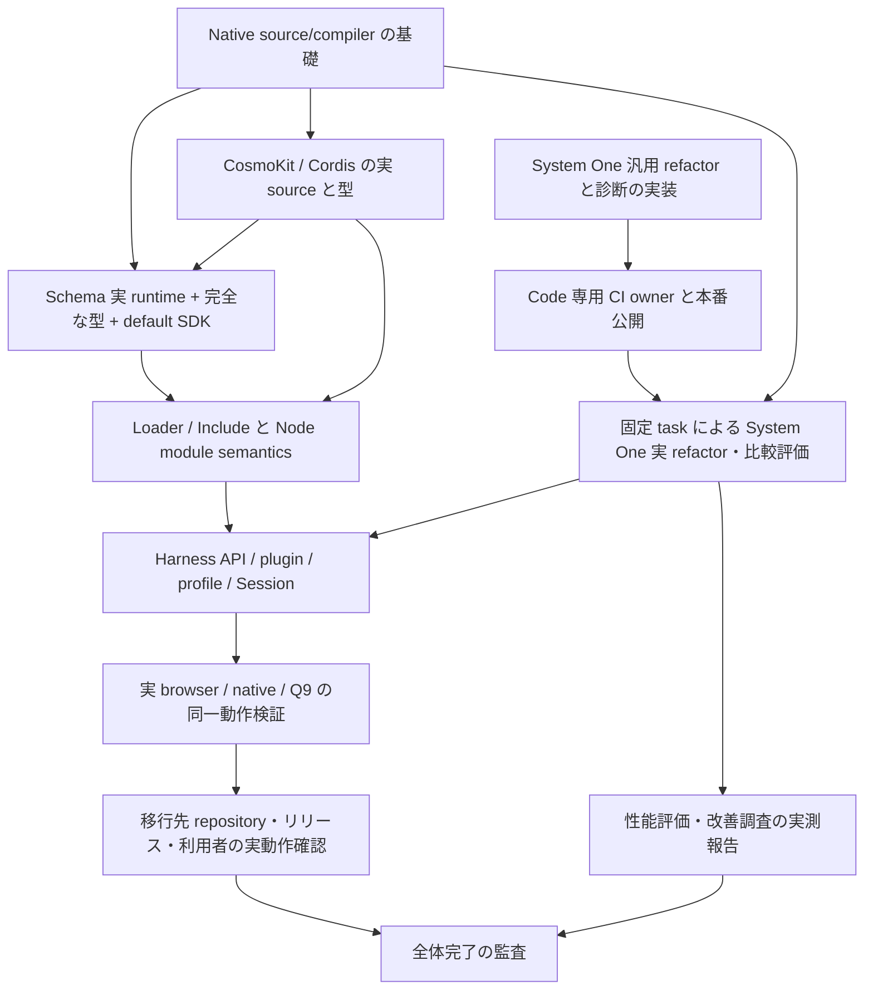

# Mithril Harness / System One：保存地点と再開マップ

保存日：2026-10-09（JST）。これは作業の区切りであり、全体完了の宣言ではない。
作業 goal は一時停止。既に開始した PR CI はそのまま動作し、停止時点では未完了。
再開時はこの記録より実 checkout、remote main、CI、公開 status を優先する。

## 最終的に実現すること

元の mithril-lang org DeepSeek Harness を、実際の Mithril 言語による
Mithril Harness に移す。元の API、plugin、profile、Session と動作を同じ範囲で
維持し、実 browser/native/Q9 まで検証する。その refactor に
code.mithril.fund の System One Coding を実際に使い、固定した入力・変更前後の
チェック・実 receipt に基づいて性能評価と改善調査を行う。
名前の置換、観測 helper、有限ケースの合格だけで、この目的を完了扱いにしない。

## 保存した場所

| 項目 | 保存先・識別子 | 状態 |
| --- | --- | --- |
| 言語/compiler checkout | `/Users/junkawasaki/github/mithril-lang/mithril-harness-language` | 現在の branch は `codex/native-module-operations`。下記未完了変更を保存 |
| 完了した Schema SDK commit | `b211a8d076bdb85f77859a2563ba3f79ee5e433f` | PR #79 に push 済み |
| Schema SDK PR | https://github.com/mithril-lang/mithril/pull/79 | OPEN。CI `37894254763` / job `113701855514` が停止直前には実行中 |
| System One checkout | `/Users/junkawasaki/github/mithril-lang/mithril-system-one-refactor` | PR #893 merged、保存した qualification source は `cc8d1bfb6dcbe30c302d24cbec214c07141e42e7` |
| 検証ログ・引継ぎ receipt | `/Users/junkawasaki/github/mithril-lang/mithril-harness-evaluation-2026-10-07` | 独立した operator evidence。元実装を candidate に委譲しない |
| 元 Harness snapshot | 上記 evidence 配下 `reference-harness-441416` | readonly reference、commit `441416c0048aa4281bffe59c1c7b5e13e08a9ec1` |

実際の移行先 Harness repository は再確認が必要。現在見えた repo catalog だけで
org 全体に存在しないとは断定しない。移行先を決めずに別 repository を作成しない。

## 全体の依存マップ

矢印は「前提 → それに依存する作業」。依存先を進めるために、前提から解消する。



System One 側の公開 gate と言語側の依存解消は独立して進められる。
Code の owner が未確定でも、言語側の作業全体を blocked にしない。

## どこまで検証したか

| 領域 | authoritative evidence | 残る条件 |
| --- | --- | --- |
| Native 数値 literal | PR #77 merged、main `4106e9e08132bfbbbb04d2d5aa79add20f264250`、main CI `37889375930` terminal success を監査済み | 整数表記 `-0` は reader が 0 に正規化。負ゼロは `-0.0` / `-0e0` |
| callback 内の ambient references | PR #78 merged、main `92a27a8e1eedbe2e1352f4a30c770ff8227172d3`、main CI `37891594652` terminal success / 全ログ監査済み | 任意の callback 全体の等価性を有限テストから推定しない |
| Schema SDK | PR #79 head `b211a8d…`。ローカル全14宣言 stage 成功。両実 CLI target で型54正常/21拒否、runtime26群、serialized Date、全 own static/prototype descriptors を元実装と比較 | PR CI、通常 merge、merged main CI の確認が必要。実 browser は未検証 |
| System One 汎用 refactor | PR #893 merged。選択ソース、全置換・局所編集、baseline/candidate Docker 検証、固定 refusal detail、durable receipt、Code 専用 signed CI/CD | 追加診断の本番公開、実 model 比較評価 |
| Code exact-main qualification | `cc8d1bfb…` で Code93/quota34/Python8/CI-release12/hold24/実Docker2/Todo17ほかを成功、署名/source/676 assets を確認 | 現在 main が進んでいるので公開前には exact current-main で再実行。旧 receipt を流用しない |
| Code 公開 status | 保存直前の GET `/api/status` は `fca16aec22fc0207ec7d91e863d3384aa92e161e`、ready=true、repository_refactor_proposals=true、durable_refactor_receipts=true | 新しい診断は未公開。arbitrary_repository_execution=false を維持 |

`js-browser` target の Node 上実行と、実 browser の動作確認は別証拠。
complete type graph と、あらゆる入力に対する runtime 同一性も別証拠。

## 未完了の変更を保存した内容

`codex/native-module-operations` は Schema SDK head を土台にした WIP branch。
この branch 自体は未 qualification・未 PR・未 merge として扱う。

- `src/mithril/form.cljk`：`host-import-meta` / `host-dynamic-import` tag を追加。
- `src/mithril/native_js.cljk`：形状を検査する AST と、直接の `import.meta` /
  `import(source[, options])` emission を追加。
- `examples/native-js-module-operations*.mith`：standalone / ESM / package の fixture。
- `test/fixtures/native-module-operations-contract.mjs`：独立した元 JS と candidate を
  比較する契約の途中。module URL/resolve、cache、namespace、TLA、coercion、
  import attributes、拒否、serialized meta callback を対象にしている。

最初の実 CLI probe は fixture の未登録 tag `mithril/param` で REFUSE した。
保存前に既存の `rdf/node` param 表現へ訂正したが、訂正後の CLI/runtime はまだ
実行していない。JS syntax check と `git diff --check` は成功。
新しい admission/negative tests、suite 登録、件数の更新、全回帰検証は未実施。
「追加済み」を「対応完了」と読み替えない。

元コードの必要箇所：

- `vendor/loader/src/internal.ts:109`：`createRequire(import.meta.url)`。
- `vendor/loader/src/config/tree.ts:124,126`：相対 URL / specifier の動的 import。
- `vendor/include/src/index.ts:222`：filename の動的 import。

Node internal loader の v1/v2 分類、no-internals fallback、実 host capability、
YAML 方言・config read/write の API は、それぞれ元の契約を維持して検証する。
固定 URL や別の resolver で代替して同一としない。

## 再開直後の手順

1. 保存 branch の clean status と commit を確認し、PR #79 / CI `37894254763`
   の同じ handle を読む。観測 timeout だけで CI を再起動しない。
2. 成功なら full log が source72/279・package40 exports/7 frozen artifacts・
   全14 declaration stages と新 SDK 契約を実行したことを監査する。
   repository policy に従って通常 merge し、merged main の別 CI を確認する。
3. WIP branch に戻り、訂正した fixture の実 CLI をまず再実行する。
   Node の元 semantics と、standalone / ESM / package の両 target を比較する。
   malformed shape、scope、depth/node budget、guest refusal と既存 artifact
   byte preservation を検証し、native suite に登録する。
4. native source/package/declaration の必要な回帰 checks を完了し、module
   operations を別 PR にする。Schema SDK が merge されるまでは二重に含めない。
5. Loader/Include を元の source closure / SCC / public type graph ごと移す。
   その後 Harness API/plugin/profile/Session、実 browser/native/Q9 へ進む。
6. Code owner が判明したら、専用資格・本番公開・公開 read-back を満たし、
   別に固定した task/check contract で System One 実 trial を行う。

pinned local toolchain：

```sh
# cwd: /Users/junkawasaki/github/mithril-lang/mithril-harness-language
node scripts/test-native-js.mjs --engine ../mithril-harness-evaluation-2026-10-07/compiler-image/engine/cli.js
node scripts/test-native-package.mjs --engine ../mithril-harness-evaluation-2026-10-07/compiler-image/engine/cli.js
node scripts/test-native-declarations.mjs --engine ../mithril-harness-evaluation-2026-10-07/compiler-image/engine/cli.js --typescript ../mithril-harness-evaluation-2026-10-07/native-js-declarations-system-one/image/typed-deps/node_modules/typescript/lib/typescript.js --type-roots ../mithril-harness-evaluation-2026-10-07/native-js-declarations-system-one/image/typed-deps/node_modules/@types
```

主なログ：`schema-sdk-full-declarations.log`、`schema-sdk-canonical-qualification.log`、
`native-ambient-main-ci.log`、`schema-sdk-qualification.json`、
`native-ambient-blocker-frontier.json`（すべて evaluation directory 内）。

## System One 公開 / 評価で必要な入力

Code 専用 deployment owner の host/checkout と、既存の狭い CI credential の
**参照名**が未確認。credential 値は chat / task / receipt / Git に保存しない。
`gad` に Docker があることだけで deployment owner と断定しない。
最後に確認した `MITHRIL_CODE_PUBLISHER` repository variable は未設定（404）。
実 owner、競合する main jobs の drain、exact clean current main、専用署名 receipt、
実 compatible rollback、quota namespace、全 migration hold、公開 assets の read-back
を満たす。Code の公開 guard と Fund `AGENTS.md` / standalone CI の規則を保持する。

旧実 model trial は `chatcmpl-ea230788-d0e3-40a9-93cb-00ee136cbea6`、
140.266秒、prompt26706/completion5261、1 attempt/0 repair、
`invalid_refactor_edits`。detail 不明、admitted candidate なし、性能改善なし。
欠けた detail を推測しない。未知の outcome や古い request を再試行しない。
次の trial は独立した固定入力・現在 compiler・baseline/candidate checks・
実 completion/usage/latency の receipt を持ち、必要な修復も測定に含める。

## 最終完了の監査条件

移行 source・全 public API/type/plugin/profile/Session・実 host/browser/native/Q9・
移行先 release/read-back・System One 実 refactor と評価の各要件に対応する証拠を
読み返す。未確認・部分検証・fixture のみの要件が一つでも残れば goal は未完了。
System One の公開 gate だけを理由に、他の独立した作業を止める必要はない。
