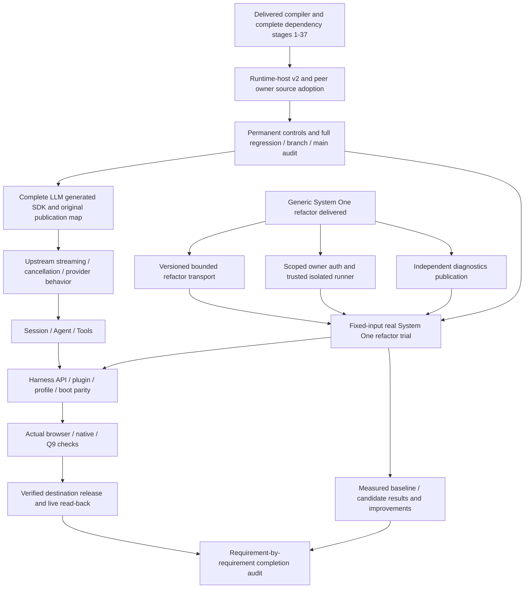

# Mithril Harness / System One: consolidated implementation map

Checkpoint: 2026-10-10 JST. This record separates delivered compiler work,
operator candidate probes and remaining product/evaluation gates. Earlier
[continuation entries](harness-refactor-continuation-2026-10-09.md) are historical.
This documentation checkpoint does not adopt the runtime-host candidate.

## Objective and completion boundary

Port the original DeepSeek Harness to actual Mithril source, preserving its API,
plugins, profiles, Session, boot and dependency behavior. Qualify the intended
published repository and actual browser/native/Q9 behavior. Use System One Coding
at code.mithril.fund for a real refactor trial and evaluate its performance with
fixed inputs, independent baseline/candidate checks and durable receipts.

Compiler progress, operator-authored ports and Node execution of a `js-browser`
artifact do not establish full Harness parity, actual browser behavior or model
performance improvement. The full objective remains open.

Original source pin: `441416c0048aa4281bffe59c1c7b5e13e08a9ec1`.
Current delivered compiler checkpoint:
`b48193abc8056ee3fc5de40809cb4737d9a14783` in `mithril-lang/mithril`.
The intended final Harness repository/publication destination still needs an
explicitly verified identity; an accessible repository catalog proves no absence.

## Delivered foundations

| Layer | Delivered evidence | Boundary |
| --- | --- | --- |
| Schema, Cordis/CosmoKit, Loader/Include, YAML, Scope, Brand, Values, Crypto/Timeout, Protocol, Attachment | Registered complete-source qualification stages; historical receipts and controls in the continuation record and `test/qualification/` | Finite Node/TypeScript controls; dependent full Harness behavior remains open |
| Tagged templates and private symbol/type ownership | PRs #106/#107, stages 33/34 | Actual browser/native execution is separate |
| Source-owned producer/consumer declaration composition | [PR #108](https://github.com/mithril-lang/mithril/pull/108), main `4ae87cb1f42ae9d84c6d8874cf076037a22c1ea5`; Native 37999221464 and CodeGraph 37999221385 full logs audited | Complete generated third-party runtime-host admission was still missing |
| Literal ECMAScript identifiers | [PR #109](https://github.com/mithril-lang/mithril/pull/109), main `28019ea5729dabf3b583c93a4a9bc46d293490c3`; Native 38003448382 and CodeGraph 38003448367 full logs audited | All 36 stages, source 85 tests/415 assertions, package 40 exports/seven frozen artifacts, Graph HTTP passed |
| Independent source-owned ESM subpath roots | [PR #110](https://github.com/mithril-lang/mithril/pull/110), main `b48193abc8056ee3fc5de40809cb4737d9a14783` | Local and branch all 37 stages passed; exact merged tree equals qualified source `e53223cd2ed8b5e5c75561e7ff9056c47ea840ae`; main Native 38004693202 pending at checkpoint, Graph 38004693153 terminal success |
| Generic System One refactor | Fund PR #893; qualified source `cc8d1bfb6dcbe30c302d24cbec214c07141e42e7` | Current publication, authenticated isolated trial and model evaluation remain separate gates |

PR #110's first local broad run failed with ENOSPC. Its retained retry completed
all 37 stages on unchanged source. No evidence/cache deletion was used. Main CI
must be audited independently of successful branch CI.

## Complete LLM/generated source checkpoint

All thirteen original LLM files and complete public declaration proposals are
retained. Original public root: 146 distinct names, 92 types and 66 values.
Bounded package composition uses 30 Core runtime modules (917830 bytes) and 14
LLM/Schema runtime modules; the generated host/client add two complete modules.
The rejected inline aggregate exceeds the unchanged 1 MiB package source limit.

Actual original Typert generation ran after ten project owners passed their own
unchanged compiler options. Complete generated host/client bodies and declarations
are preserved. Earlier installed Core/LLM root consumers passed 12 positive/15
negative strict original-paired groups and same/different-owner controls. Root
aliases `types`, `brand`, `message`, `assistant-stream` passed local installed
probes. These operator probes are not complete SDK publication qualification.

## Saved candidate: runtime hosts and augmentation peers

[Candidate patch](harness-checkpoints/2026-10-10/runtime-host-candidate.patch)
contains only proposed source changes, based on `e53223c`; it is not applied to
compiler source. [Checkpoint metadata](harness-checkpoints/2026-10-10/runtime-host-candidate.json)
records probe identities and limitations. Verify the patch hash and base before
adoption; do not replay it against an unverified working tree.

The proposed v2 composition contract declares bounded runtime-only hosts by
package, version, canonical SHA512 integrity and exact module/specifier/export
grants. It preserves v1 fields/output bytes, source owners and existing limits.
Host declaration imports, unused grants, source collisions and mismatched exports
are refused. The compiler validates source claims; independent publication must
verify the actual full package tarball and version.

The actual generated remote declarations revealed a same-block peer resolution
failure: a newly declared interface and a reexported interface have different
actual owners. Proposed peer bindings retain the original lexical block while
resolving each interface to its actual owner. Shadowing is per symbol space, so a
type-only peer retains a same-name private value/unique-symbol source owner.

| Candidate evidence | Verified scope | Required follow-up |
| --- | --- | --- |
| Runtime-host admission controls | 19 exact refusal cases using actual complete Core/LLM/generated source | Permanent portable stage registration and early CLI refusal controls |
| Independent peer fixture | Both CLI labels; 3 positive/5 negative strict exact-code original-paired cases, new barrel/reexported leaf owners and same-name private unique-symbol value | Full module-augmentation and SDK regression on final per-space fix |
| Actual Core/LLM/generated composition | 44 complete declaration documents, 45 emitted files; both CLI labels; root surface unchanged | Revalidate on adopted final source; full source/package/CI/main gates |
| Real pinned external host | Full Zod 4.4.3 tarball integrity/version independently checked; canonical shared ESM | Portable pinned publisher controls; no partial shim |
| Generated runtime comparison | 10 factory pairs, 200 original parse pairs, metadata/cache/name/arity/ZodError identity | Broader original behavior and final-source rerun |
| Remote SDK consumers | 5 positive/7 negative strict ordinary NodeNext pairs with full original RPC/namespace augmentation | Final-source rerun and published routes |
| Compatibility | Previous 43 v1 declaration files and metadata unchanged in probe | Repeat after final peer change |

The 200-pair, 45-file and v1 checks precede the final per-space peer fix. The
independent peer fixture was rerun after that fix. Do not imply all earlier SDK
checks qualify the final candidate. Prior failed probes remain evidence.

## Prerequisite graph and work order

Arrows mean prerequisite → dependent; work starts with unresolved prerequisites.
Independent System One gates can advance alongside language work.

1. Audit PR #110's existing exact-main Native run and Graph full logs; preserve
   their run IDs instead of restarting for observation timeouts.
2. Apply the saved candidate on an isolated branch based on verified merged main.
   Register permanent runtime-host and independent peer controls as the next
   qualification stage. Preserve exact caps, source/private owners, v1 bytes,
   pre-write rejection and original full third-party dependencies.
3. Rerun final-source augmentation, complete 45-file composition, v1 43-file byte
   controls, 5/7 remote consumers and 200 runtime pairs. Then source 85/415,
   package 40/seven, all registered stages, branch CI, merge and exact-main audit.
4. Qualify the full original LLM publication map, including `typert`, `remote`,
   `src/*` and `package.json`; finish upstream streaming/cancellation/provider
   checks without substituting type projections or resolver hooks.
5. Port and qualify Session/Agent/Tools and full API/plugin/profile/boot behavior,
   followed by actual platform tests and verified destination publication.
6. Resolve System One gates below, conduct a real bounded trial, investigate
   measured failures and improvements, then audit the full original objective.

## System One: independent unresolved gates

The existing v1 contract bounds editable files to 32, union files to 40, goal
characters to 4000, input JSON to 98304 bytes, normalized whole changes to 49152
bytes and final output to 147456 bytes. A small edit to an 80 KiB compiler source
can expand beyond the whole-change bound. Implement genuinely versioned bounded
transport and trusted reconstruction while preserving v1; do not simply raise
limits, truncate source or reduce declarations to signatures.

Verify scoped owner authentication live without exposing secrets. Verify the
trusted Docker runner: network none, read-only, nonroot 65534, dropped capabilities,
no-new-privileges, pids 128, CPU 2, memory 1 GiB and bounded workspace/tmp tmpfs.
Do not restart Docker/VM or run model proposals through an untrusted Node fallback.
An authentication observation timeout is neither denial nor proof of readiness.
Current signed diagnostics publication needs its own exact-source read-back.

Only the prior actual request `chatcmpl-ea230...` is recorded: 140.266 seconds,
26706 prompt tokens, 5261 completion tokens, one attempt, zero repairs; rejected
`invalid_refactor_edits` with missing detail and no adoption. No new inference or
performance gain is established by this checkpoint. Measure real successful and
failed trials separately, retaining model/input/config identity and refusal detail.

## Evidence and resumption

Repository evidence: [identifier main audit](harness-checkpoints/2026-10-10/identifiers-main-ci-audit.json),
[subpath branch audit](harness-checkpoints/2026-10-10/subpaths-branch-ci-audit.json),
[subpath merged file/tree identity](harness-checkpoints/2026-10-10/subpaths-main-file-match.json).

Local evidence directory:
`/Users/junkawasaki/github/mithril-lang/mithril-harness-evaluation-2026-10-07`.
It retains full CI logs, failed/successful probes, pinned original sources,
installed packages, candidate source, `controls.cljk`, `peer-controls.cljk` and
`check-peers.mjs`. Local paths are resumption pointers, not portable CI inputs.
Compiler checkout: `mithril-harness-language`; System One checkout:
`mithril-system-one-refactor`. Reverify Git status and exact remote heads first.

This map and candidate preservation are a documentation delivery. Runtime-host
source adoption, complete Harness parity and System One performance evaluation
remain open after this map is merged.
